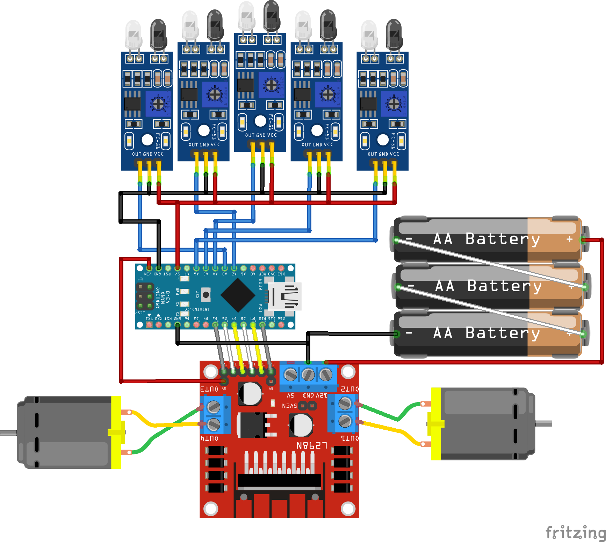

# BasicLFR
***
A basic line follower robot that ca handle `T-section` and any angle larger then `15 degree` also `Traingluar loop`.

## Components

1. ### Arduino Nano
2. ### L298N motor driver
3. ### 5 Digital IR-Sensor
4. ### 2 12V DC motor. I have used micrometal gear motor for     better performance.
5. ### 11.1V 3 Cell LiPo battery 2200mAh

***

## Circuit Diagram

  
***

## final prototype

#### Assambled by [Falgon_Sen_Apu](https://www.linkedin.com/in/falgoon-sen-apu-188a63168)
***
## Unit Test on [Youtube](https://www.youtube.com/watch?v=54BsUsKn69U)

